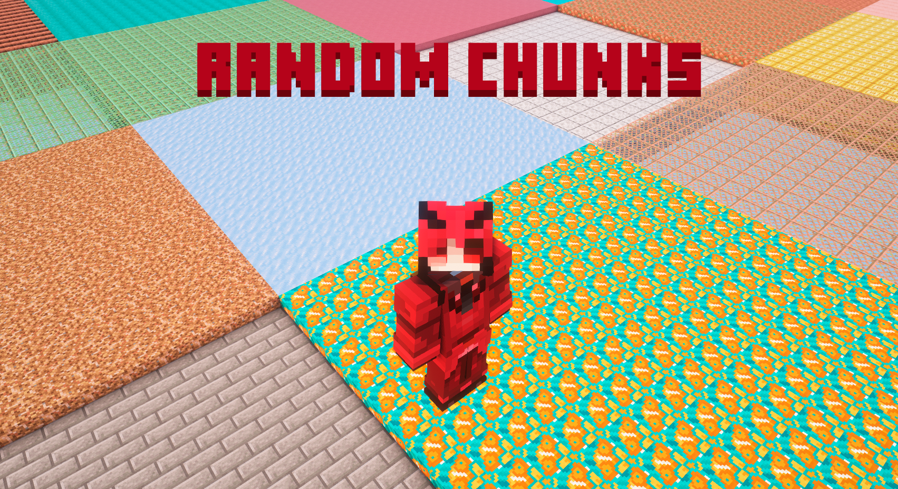

## This mod makes every chunk replace all itself block with random one whenever you enter it! 

### Installation:

1. Required [quilt modloader](https://quiltmc.org/en/), quilt loader must be >= 0.19.1
2. Required [quilted fabric api](https://modrinth.com/mod/qsl) >= 7.0.2
3. Minecraft 1.20+ versions (tested on 1.21)

### Usage:

The mod is turned off by default so that you can play other worlds without changes. Type command `/randomchunks start` to enable mod. If you want to disable it use command `/randomchunks stop`.

Use command `/randomdrops info` to see actual information about mod usage in your world
